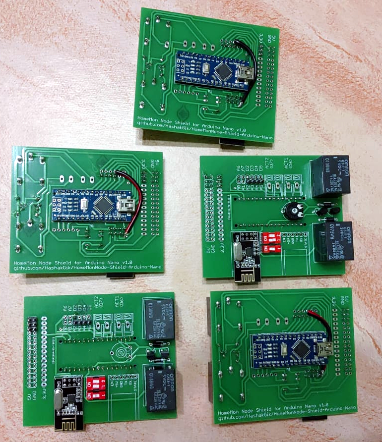

HomeMon Node sketch for Arduino Nano
====================================

Introduction
------------

The HomeMon project is a simple wireless sensor network for domotic use.
It comprises sensor nodes which broadcast their state over a meshed peer-to-peer network and a [viewer application](https://github.com/HashakGik/HomeMon-MFC-Cpp) capable of displaying data received from a sink node.

This Arduino nano sketch uses the [HomeMon node shield](https://github.com/HashakGik/HomeMonNode-Shield-Arduino-Nano).

Each node can sense up to eleven local and sixteen remote signals, and drive up to two actuators when triggering conditions are met.

For debugging purposes, a [node emulator](https://github.com/HashakGik/HomeMon-Node-Emulator-Ruby) is also available.

Features
--------

- The nodes share the same firmware and each of them can act as a sink, by simply connecting it to a PC (via serial or bluetooth)
- Configuration is done via serial/bluetooth interface (connect at 9600 bauds, 1 stop bit, no parity and 8 data bits, type `help` for a list of available commands) and stored on the internal EEPROM for persistent storage
- New sensors can be attached at runtime to 16-characters signals (e.g. temperature sensor on pin A3 attached to variable bathroom_temp)
- Triggering conditions can be set at runtime between two signals (either local or remote) or a signal and a constant (e.g. "turn on the lamp connected to actuator 1 when people_number > 0" or "turn on the boiler connected to actuator 2 when bathroom_temp < outside_temp")
- The nodes communicate between each other via a radio interface and with the client PC via USB or bluetooth
- If the bluetooth, the radio, or both interfaces are not available, a node will still work correctly.

Remarks
-------

- The code is composed of mostly C-style functions and global variables, in order to keep the stack as small as possible, but the input signals are modeled by a hierarchy of C++-style classes for easier extendability.